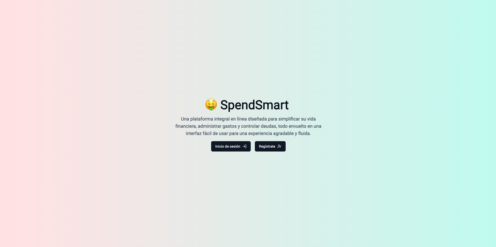
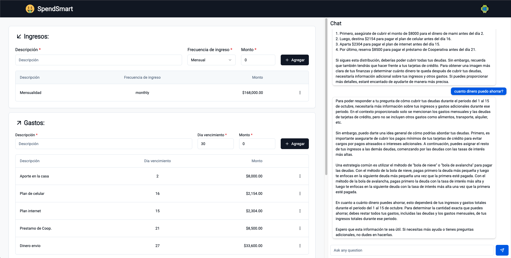

## SpendSmart AI

Description:
The project aims to develop an online platform that allows users to organize and manage their payments and personal finances effectively. The platform will provide tools and functionalities that help users track their payments, manage their expenses, set budgets, and control their debts. The user interface will be intuitive, and the design will focus on providing a pleasant and seamless user experience.

Goal:
To create an online solution that assists individuals in maintaining more effective financial control by facilitating the organization and management of their payments and personal finances. The ultimate objective is to provide a tool that enables users to make informed financial decisions, save money, and achieve greater financial stability.

**Objectives:**

1. Develop a user registration system that allows users to create personalized accounts and access the platform's functionalities.
2. Design an intuitive dashboard that provides users with a clear overview of their financial situation, including balances, pending payments, debts, etc.
3. Develop an expense tracking tool that allows users to record and categorize their daily expenses, providing visual graphs and reports for better understanding of their spending habits.
4. Provide a financial reporting feature that allows users to generate customized reports on their financial situation, such as statements, expense summaries, income reports, etc.
5. Offer educational resources related to financial management, such as articles, tips, and guides, to help users acquire financial knowledge and skills.




## Getting Started

First, run the development server:

```bash
npm run dev
# or
yarn dev
# or
pnpm dev
```

Open [http://localhost:3000](http://localhost:3000) with your browser to see the result.

You can start editing the page by modifying `app/page.tsx`. The page auto-updates as you edit the file.

This project uses [`next/font`](https://nextjs.org/docs/basic-features/font-optimization) to automatically optimize and load Inter, a custom Google Font.

## Learn More

To learn more about Next.js, take a look at the following resources:

- [Next.js Documentation](https://nextjs.org/docs) - learn about Next.js features and API.
- [Learn Next.js](https://nextjs.org/learn) - an interactive Next.js tutorial.

You can check out [the Next.js GitHub repository](https://github.com/vercel/next.js/) - your feedback and contributions are welcome!

## Deploy on Vercel

The easiest way to deploy your Next.js app is to use the [Vercel Platform](https://vercel.com/new?utm_medium=default-template&filter=next.js&utm_source=create-next-app&utm_campaign=create-next-app-readme) from the creators of Next.js.

Check out our [Next.js deployment documentation](https://nextjs.org/docs/deployment) for more details.
